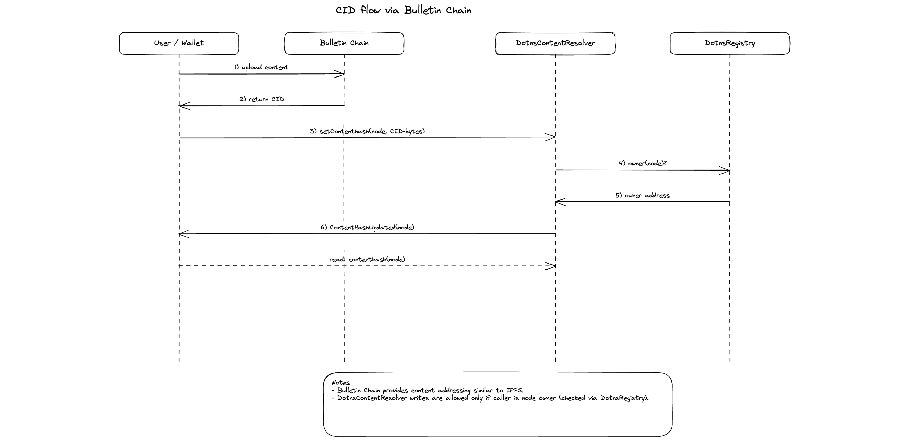

# Dotns

Smart contracts for registering `.dot` names on Polkadot

## Diagrams

### Registration flow


### Subnode creation flow


### CID flow (Bulletin Chain)



### System diagram


## Deployment note

To deploy on Paseo you need a local ETH-RPC adapter.

A `docker-compose` file is provided. Start it first, then run the deployment scripts from `package.json`, for example:

```bash
bun run deploy:testnet
```

## Contracts

### `DotnsRegistrarController`

Commit–reveal controller that validates commitments, enforces pop rules checks, and orchestrates registration side effects (minting, registry wiring, reverse record, Store writes, refunds).

### `DotnsRegistrar`

ERC721-backed registrar that mints ownership of label IDs (labelhashes). Minting is restricted to authorised controllers.

### `DotnsRegistry`

Forward registry mapping node → `(owner, resolver)` and supporting subnode creation. Privileged node wiring is restricted to the configured registrar controller.

### `PopRules`

PoP-aware name classification and pricing. Enforces base-name reservation rules derived from Lite-eligible registrations.

### `DotnsReverseResolver`

Reverse records mapping address → primary name. Writes are restricted to an authorised registrar/controller.

### `DotnsContentResolver`

Stores `contenthash` and text records per node. Writes require node ownership (or approved operator if enabled).

### `DotnsResolver`

Stores forward-resolution address records per node. Writes require node ownership.

### `StoreFactory` and `Store`

Per-user storage used to persist DotNS-written records. 

### Build

```bash
forge build
```

### Test

```bash
forge clean
forge test
```
