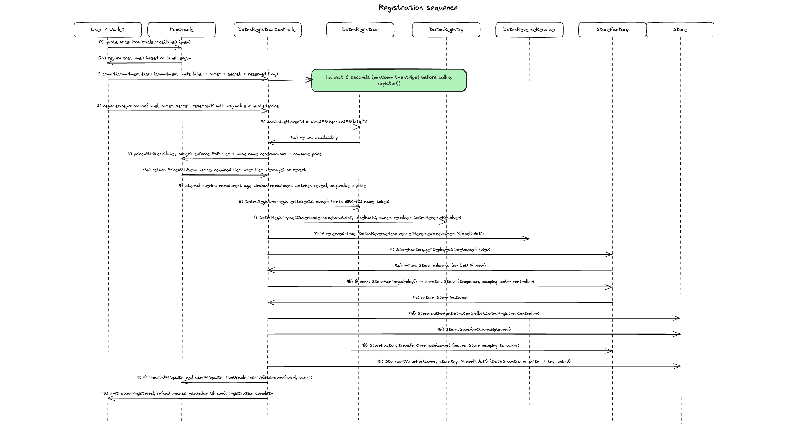
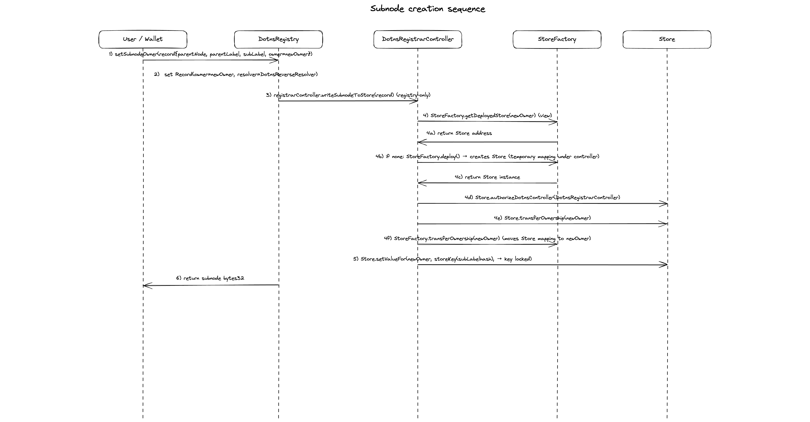

# Dotns

Smart contracts for registering `.dot` names on Polkadot

## Diagrams

### Registration flow



### Subnode creation flow



### CID flow (Bulletin Chain)


### System diagram


## Deployment note

To deploy on Paseo you need a local ETH-RPC adapter.

A `docker-compose` file is provided. Start it first, then run the deployment scripts from `package.json`, for example:

```bash
bun run deploy:testnet
```

## Contracts

### `DotnsRegistrarController`

Commit–reveal controller that validates commitments, enforces pop rules checks, and orchestrates registration side effects (minting, registry wiring, reverse record, Store writes, refunds).

### `DotnsRegistrar`

ERC721-backed registrar that mints ownership of label IDs (labelhashes). Minting is restricted to authorised controllers.

### `DotnsRegistry`

Forward registry mapping node → `(owner, resolver)` and supporting subnode creation. Privileged node wiring is restricted to the configured registrar controller.

### `PopRules`

PoP-aware name classification and pricing. Enforces base-name reservation rules derived from Lite-eligible registrations.

### `DotnsReverseResolver`

Reverse records mapping address → primary name. Writes are restricted to an authorised registrar/controller.

### `DotnsContentResolver`

Stores `contenthash` and text records per node. Writes require node ownership (or approved operator if enabled).

### `DotnsResolver`

Stores forward-resolution address records per node. Writes require node ownership.

### `StoreFactory` and `Store`

Per-user storage used to persist Dotns-written immutable records. Deployed to Paseo

### Deployments
| Contract                 | Address                                    |
| ------------------------ | ------------------------------------------ |
| StoreFactory             | 0x030296782F4d3046B080BcB017f01837561D9702 |
| DotnsRegistrar           | 0x329aAA5b6bEa94E750b2dacBa74Bf41291E6c2BD |
| DotnsReverseResolver     | 0x95D57363B491CF743970c640fe419541386ac8BF |
| DotnsRegistry            | 0x4Da0d37aBe96C06ab19963F31ca2DC0412057a6f |
| DotnsContentResolver     | 0x7756DF72CBc7f062e7403cD59e45fBc78bed1cD7 |
| DotnsResolver            | 0x95645C7fD0fF38790647FE13F87Eb11c1DCc8514 |
| PopRules                 | 0x4e8920B1E69d0cEA9b23CBFC87A17Ee6fE02d2d3 |
| DotnsRegistrarController | 0xd09e0F1c1E6CE8Cf40df929ef4FC778629573651 |


### Mental model for new features

Treat the chain as the database. Assume no servers and no indexers. If a feature needs an offchain service to be usable, it is not a DotNS feature.

This has a practical implication: every feature must come with an explicit query path. A client should be able to start from a small set of known contracts and find everything it needs with a bounded number of calls.

Rules of thumb:

- State is the source of truth. Events are for observability.
- Discovery must be deterministic. If something is created, store where to find it.
- Avoid “scan and reconstruct”. Do not require replaying logs from genesis to recover user state.
- Prefer simple keys. `node`, `labelhash`, `owner`, `commitment` should be enough to locate related data.
- If you need lists, make them enumerable onchain with pagination. Do not assume an indexer will build the list.
- If a rule matters for funds or correctness, enforce it onchain. Offchain checks are optional UX.

A quick checklist for a PR adding a feature:

- Where is the canonical state stored?
- From which known contract can a client discover it?
- What are the exact view functions needed to read it without scanning?
- How does a client list relevant items (if listing is required), and how is it paginated?

### Build

```bash
forge build
```

### Test

```bash
forge clean
forge test
```
